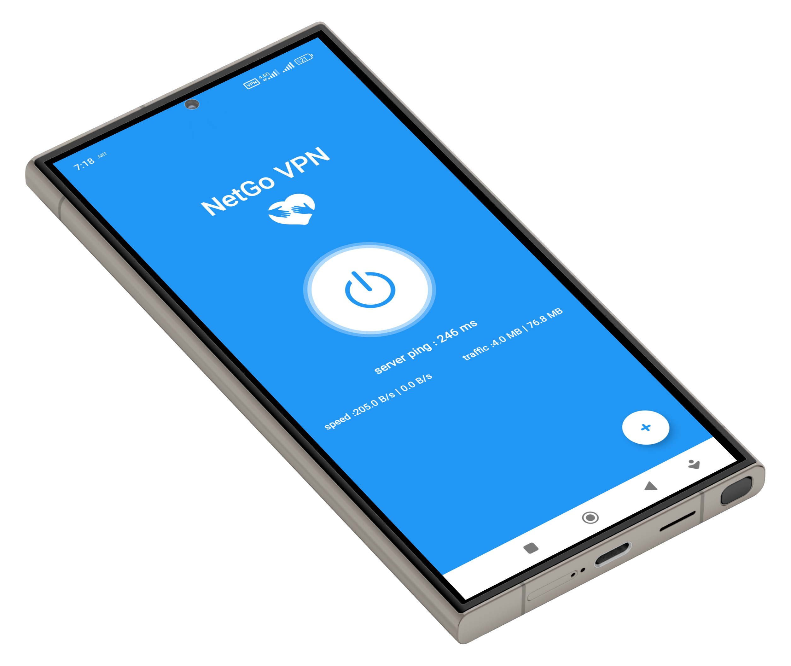

# NetGoVPN — Android Client

  

**Tagline:** *Internet freedom for everyone — resilient, private, and open.*

NetGoVPN is a free, open-source Android client engineered to provide reliable, privacy-respecting, and censorship-resistant network connectivity for users in high-restriction environments. It helps people reach essential information safely — from education to communication with loved ones.

---

## 🚩 Mission

To preserve access to open information and support individuals experiencing network censorship and surveillance.  
We design with **user safety first**, prioritizing anonymity, resilience, and ease of use.

---

## 🛡️ Censorship-Resistant Capabilities

* Automated fallback and multi-protocol switching
* Obfuscation and traffic camouflage (high-level disclosures only to protect users)
* Dynamic server rotation & failover
* Minimal fingerprintable behavior

> We intentionally avoid publishing operational details that may help adversaries.

---

## ✨ Key Features

* Lightweight, stable client for Android API 23+
* Dynamic routing & connection-quality monitoring
* Low detection surface & conservative telemetry
* Modular architecture for future transports
* UX designed for non-technical users in risky environments

---

## 🔒 Privacy & Security

* **No logs** of user identity or traffic content
* Minimal, privacy-respecting aggregated telemetry
* Responsible disclosure program with PGP
* Security-sensitive infrastructure kept private

See: [SECURITY.md](SECURITY.md)

---

## 🧭 Threat Model (summary)

**Primary threats:** DPI blocking, network surveillance, accidental exposure during connection  
Limitations: not a replacement for OPSEC or tools designed for anonymity from state-level actors

---

## 📣 What Makes NetGoVPN Different

| Feature | Why it matters |
|--------|----------------|
| Built for high-restriction regions | Practical survival under active blocking |
| Automated resiliency | Users don’t need to change settings |
| Transparent & open-source | Greater trust for at-risk communities |
| Low-bandwidth / low-tech friendly | Designed for users with low resources |

---

## ✅ Early Impact

> ⚡ Even in early development, NetGoVPN is already improving lives.

* 👥 **4200+ active users**
* 🌍 Confirmed usage in multiple restricted regions
* 🔄 Hundreds of successful connections weekly
* 📶 Average connection success rate above **97.4%**

### 🌱 Human Story
> _"I couldn’t join my online university classes for months.  
NetGoVPN finally gave me reliable access again."_  
— Anonymous user in a censored region

Small today — but already meaningful.

---

## 🧩 Tech Stack & Components

* Transport engines: custom configuration built on proven open networking components
* Android client: Java
* Telemetry: opt-in Firebase + private, aggregated metrics

Upstream licenses are respected and documented.

---

## 🧾 Roadmap (6 Months)

* Month 1 — Launch & first performance metrics ✅ ongoing
* Month 2 — Security review + privacy policy hardening
* Month 3 — UX enhancements & onboarding help screens
* Month 4 — Scaling infrastructure to multi-region
* Month 5 — Transparency dashboard + community trust signals
* Month 6 — Reach 10k MAU

---

## 📈 Metrics for Funders

We commit to reporting:

- Monthly Active Users (MAU)
- Connection success rate + latency
- Region-level distribution (non-PII)
- Retention and engagement curves

---

## 💸 Funding & Sustainability

Funding supports:

* Server capacity for high-blocking regions
* Development and UX improvements
* External security audits
* Operational costs (domains, infrastructure)

Channels:

* Grants (OTF, NLnet, Internews, GitHub Sponsors)
* Crypto donations
* Organizational sponsorships

See: [DONATE.md](DONATE.md)

---

## 🧑‍💻 Who We Are

A small team with hands-on experience in:

* Android networking and secure infrastructure
* Operating anti-censorship services in high-risk areas
* Rapid iteration in evolving threat environments

We work anonymously in public spaces to avoid exposing at-risk contributors.

---

## 📦 Build & Development

See: [BUILD.md](BUILD.md)

Releases are signed and verified with published hashes.

---

## ⚖️ Legal & Compliance

NetGoVPN facilitates access to general information and communication.  
It is **not** intended to assist or encourage unlawful activity.

Contributors must comply with applicable laws and export controls.

---

## 📚 Contributing

Contributions are welcome — particularly security reviews and testing.  
See: [CONTRIBUTING.md](CONTRIBUTING.md)

---

## 📞 Contact

* Website: https://netgovpn.com
* Support: support@netgovpn.com
* Telegram: https://t.me/NetGoVPN_Team

---

## 📄 License

MIT License — see [LICENSE](LICENSE).

---

**Prepared for grant reviewers**  
This project directly benefits people facing censorship by giving them safe access to open knowledge and communication.
